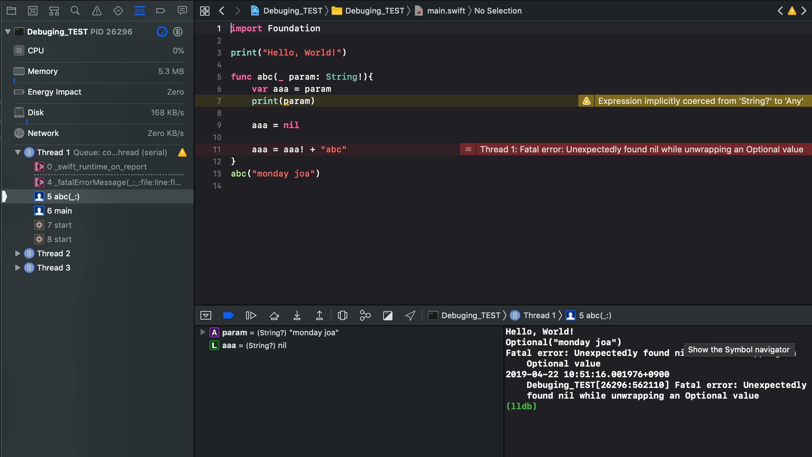
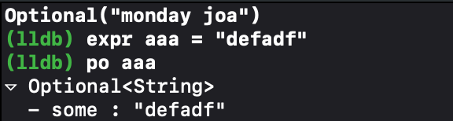

# 2019. 04.22 (Yagom)

## 디버깅
============
### 1. 논리적 오류(컴파일 오류)는 Unit Test로
### 2. 런타임 오류는 Unit Test + Debuging

[그림 1]<br>

<br>
- show the debug navigator :  [그림 1]의 왼쪽 창을 보면 CPU, Memory, Energy Impact등이 각각 어떤 status를 나타내고 있는지 명시하고 있다. 

1. 디버깅 영역
	: 콘솔창을 보면 알 수 있듯이 첫번째로 <u>'오류메시지를 파악한다'</u> 오류 메세지를 파악할 때에는 콘솔창에 명시되어있는 오류 메시지가 가장 큰 힌트이다. <br> 오류 발생의 가장 큰 문제는 ```Fatal error: ```의 윗줄에 존재하는```Optional( “monday joa”)```이다. <br> 붉은 색 메시지 창을 보도록 한다. <br> 두번째로는  <u> 함수나 스코프의 변수들을 추적해본다.</u>

세번째로는 <u> ( lldb ) 스위프트 컴파일러이자 디버거인 lldb의 명령어를 활용한다.</u>

<br>


- po (print object) : 특정 변수에 대해 출력<br>
[그림 2]<br>

<br>


- expr (expression)  : 특정 변수에 대해 코드를 작성<br>
[그림 3]<br>

<br>

- step over : 다음 breakpoint로 넘어가겠다.
- step into : 특정 코드라인(호출된 함수)내부로 들어가겠다. 
- step out to : 호출된 함수가 있던 코드의 밖으로 나가겠다.


 [참조 링크 1]: swift 공식문서 입니다. lldb의 사용법 및 디버깅에 대해 나와있습니다. <br>
 [참조 링크 2]: 한글로 잘 정리되어 있는 블로그입니다. 편하게 버그를 추적하기 위해 LLDB를 이용한 디버깅 방법을 기록해 놓은 블로그입니다.


[참조 링크 1]: <https://help.apple.com/xcode/mac/10.2/index.html?localePath=en.lproj#/devda5478599>
[참조 링크 2]: <http://minsone.github.io/ios/mac/xcode-lldb-debugging-with-xcode-and-lldb>


